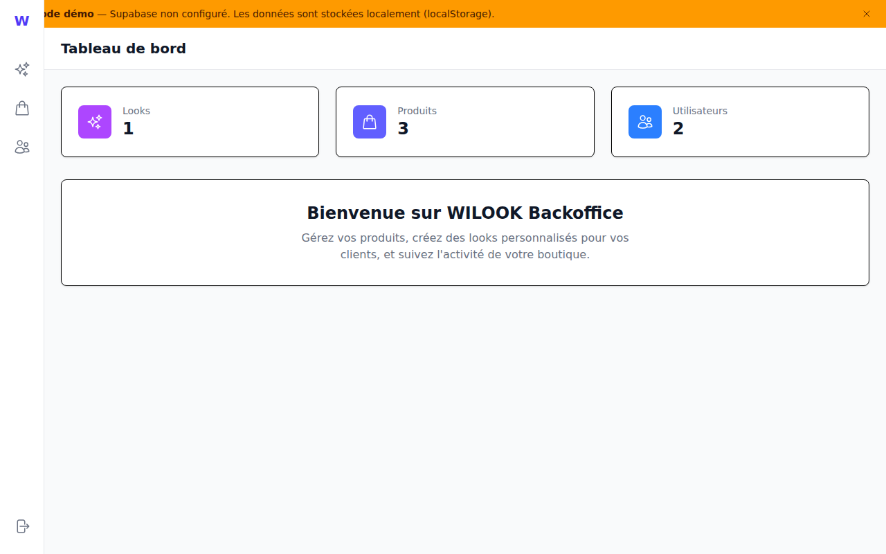

# WILOOK Clothing E-Commerce Backoffice (React)

A modern backoffice application for managing a fashion e-commerce business, built with React and best practices.



## Tech Stack

- **React 19** with TypeScript (strict mode)
- **React Router v7** for routing
- **TanStack Query** for data fetching and caching
- **Zustand** for lightweight state management
- **Tailwind CSS** for styling
- **Vite** as build tool
- **Supabase** for backend (PostgreSQL + Auth + Storage)
- **Heroicons** for icons

## Features

### Product Management
- CRUD operations for fashion items
- Advanced filtering (category, type, brand, colors, materials, sizes, price range)
- Image upload with drag-and-drop
- Infinite scroll pagination

### Look (Outfit) Creation
- 5-slot visual layout for outfit composition
- Drag-and-drop products into slots
- Customer assignment
- Public/private toggle

### Customer Management
- Customer profiles with questionnaire data
- Style preferences tracking
- Look history per customer

### Demo Mode
When Supabase is not configured, the app runs in **demo mode**:
- Data is stored locally in localStorage
- A warning banner is displayed (dev only)
- Pre-loaded with sample products and customers

## Project Structure

```
src/
├── components/
│   ├── layout/          # Navbar, Toolbar, Layout
│   ├── ui/              # Reusable UI components (Button, Input, Modal, etc.)
│   ├── products/        # Product-specific components
│   ├── looks/           # Look-specific components
│   └── customers/       # Customer-specific components
├── pages/               # Route pages
├── services/            # API service layer (Supabase + mock fallback)
├── hooks/               # Custom React hooks (TanStack Query wrappers)
├── stores/              # Zustand stores
├── types/               # TypeScript type definitions
├── config/              # Constants and configuration
└── utils/               # Utility functions
```

## Getting Started

### Prerequisites
- Node.js 18+
- npm or pnpm

### Installation

```bash
# Install dependencies
npm install

# Start development server (works without Supabase in demo mode)
npm run dev
```

### With Supabase (optional)

```bash
# Copy environment variables
cp .env.example .env

# Add your Supabase credentials to .env
# VITE_SUPABASE_URL=your-supabase-url
# VITE_SUPABASE_ANON_KEY=your-anon-key

# Restart the dev server
npm run dev
```

### Scripts

```bash
npm run dev      # Start development server
npm run build    # Build for production
npm run preview  # Preview production build
npm run lint     # Run ESLint
```

## Best Practices Implemented

### Architecture
- **Service Layer Pattern** - Clean separation between UI and data fetching
- **Custom Hooks** - Business logic encapsulated in reusable hooks
- **Component Composition** - Small, focused, reusable components
- **Graceful Degradation** - Works offline with mock data

### State Management
- **TanStack Query** for server state (caching, refetching, pagination)
- **Zustand** for UI state (minimal, simple, no boilerplate)
- **URL State** for filters (shareable, bookmarkable)

### TypeScript
- Strict mode enabled
- Proper type definitions for all entities
- Generic types for reusable patterns

### Performance
- Lazy loading with React Router
- Infinite scroll for large lists
- Image optimization with lazy loading
- Efficient re-renders with proper memoization

### Code Quality
- Consistent file structure
- Named exports for better tree-shaking
- Path aliases (@/) for clean imports

## Environment Variables

| Variable | Description |
|----------|-------------|
| `VITE_SUPABASE_URL` | Your Supabase project URL (optional) |
| `VITE_SUPABASE_ANON_KEY` | Your Supabase anonymous key (optional) |

## License

MIT
